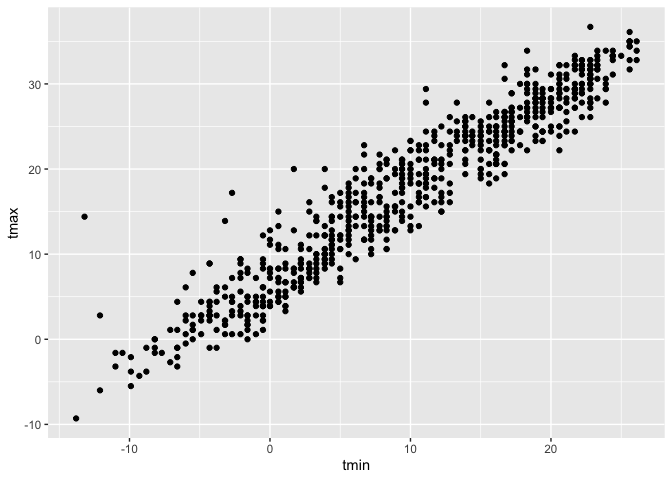

Iterations and List Cols
================
Shivalika Chavan
2025-10-28

``` r
library(tidyverse)
## ── Attaching core tidyverse packages ──────────────────────── tidyverse 2.0.0 ──
## ✔ dplyr     1.1.4     ✔ readr     2.1.5
## ✔ forcats   1.0.0     ✔ stringr   1.5.1
## ✔ ggplot2   3.5.2     ✔ tibble    3.3.0
## ✔ lubridate 1.9.4     ✔ tidyr     1.3.1
## ✔ purrr     1.1.0     
## ── Conflicts ────────────────────────────────────────── tidyverse_conflicts() ──
## ✖ dplyr::filter() masks stats::filter()
## ✖ dplyr::lag()    masks stats::lag()
## ℹ Use the conflicted package (<http://conflicted.r-lib.org/>) to force all conflicts to become errors
library(rvest)
## 
## Attaching package: 'rvest'
## 
## The following object is masked from 'package:readr':
## 
##     guess_encoding
```

``` r
l = 
  list(
    vec_numeric = 1:23,
    vec_char = c("Shivalika"),
    mat = matrix(1:8, nrow = 2, ncol = 4),
    summary = summary(rnorm(1000), mean = 4)
  )

l[[1]]
```

    ##  [1]  1  2  3  4  5  6  7  8  9 10 11 12 13 14 15 16 17 18 19 20 21 22 23

``` r
l[["vec_numeric"]]
```

    ##  [1]  1  2  3  4  5  6  7  8  9 10 11 12 13 14 15 16 17 18 19 20 21 22 23

``` r
l$mat
```

    ##      [,1] [,2] [,3] [,4]
    ## [1,]    1    3    5    7
    ## [2,]    2    4    6    8

``` r
list_normals = 
  list(
    a = rnorm(30, mean = 3, sd = 1),
    b = rnorm(30, mean = 30, sd = 0.5),
    c = rnorm(30, mean = -4, sd = 3),
    d = rnorm(30, mean = 12, sd = 4)
  )
```

Can either copy and paste the function

``` r
source("source/mean_and_sd.R")

mean_and_sd(list_normals[[1]])
```

    ## # A tibble: 1 × 2
    ##    mean    sd
    ##   <dbl> <dbl>
    ## 1  2.99 0.830

``` r
mean_and_sd(list_normals[[2]])
```

    ## # A tibble: 1 × 2
    ##    mean    sd
    ##   <dbl> <dbl>
    ## 1  30.1 0.487

``` r
mean_and_sd(list_normals[[3]])
```

    ## # A tibble: 1 × 2
    ##    mean    sd
    ##   <dbl> <dbl>
    ## 1 -4.65  3.42

``` r
mean_and_sd(list_normals[[4]])
```

    ## # A tibble: 1 × 2
    ##    mean    sd
    ##   <dbl> <dbl>
    ## 1  11.0  3.74

Use a loop to iterate

``` r
output = vector("list", length = 4) #defining an empty list

for (i in 1:4){
  
  output[[i]] = mean_and_sd(list_normals[[i]])
  
}
```

or…

``` r
output = map(list_normals, mean_and_sd)
# can use this for any function
output = map(list_normals, median)
```

Map variants

``` r
map_dfr(list_normals, mean_and_sd, .id = "sample")
```

    ## # A tibble: 4 × 3
    ##   sample  mean    sd
    ##   <chr>  <dbl> <dbl>
    ## 1 a       2.99 0.830
    ## 2 b      30.1  0.487
    ## 3 c      -4.65 3.42 
    ## 4 d      11.0  3.74

``` r
map_dbl(list_normals, median)
```

    ##         a         b         c         d 
    ##  2.879952 30.286500 -4.419000 11.393099

list cols in data frame

``` r
list_col_df = 
  tibble(
    name = c("a", "b", "c", "d"),
    sample = list_normals
  )

pull(list_col_df, sample)
```

    ## $a
    ##  [1] 2.308677 2.130279 4.086186 2.090212 3.424569 2.997003 2.539975 2.845514
    ##  [9] 2.184713 3.245969 2.755692 2.761660 4.268822 1.882364 3.665651 2.462072
    ## [17] 3.890284 2.593005 4.826072 4.338100 3.495279 2.316469 3.666128 3.727085
    ## [25] 2.232527 3.222374 3.277817 1.244897 2.443244 2.914390
    ## 
    ## $b
    ##  [1] 30.20570 30.40945 29.45912 30.70782 30.33710 29.27053 30.33386 30.29836
    ##  [9] 28.98236 30.06204 30.39074 30.07610 29.66500 30.66151 30.34508 29.98401
    ## [17] 30.37459 29.47716 29.38549 30.32211 29.16530 29.99626 30.81878 30.43220
    ## [25] 30.27464 30.67801 30.49634 30.17055 30.41438 29.82822
    ## 
    ## $c
    ##  [1]  -4.1555670  -8.7137829  -3.4659676  -2.0177643  -7.6022623  -9.4590535
    ##  [7]   4.2916386  -7.1469579  -6.4913148  -4.9257195   1.0362802  -4.4851459
    ## [13]  -7.3145145  -4.9230106  -5.6912297  -2.0620090  -3.8095347  -0.5966875
    ## [19]  -8.0064624  -2.9148741  -3.2836919  -1.8588770  -3.0164280 -11.7021141
    ## [25]  -4.3528536  -0.8381749  -4.8411859  -9.6384014  -7.9553580  -3.4531898
    ## 
    ## $d
    ##  [1] 12.615453  5.256194 12.243598  9.880213 15.536162 11.357995  8.905553
    ##  [8] 14.254199 10.283153 14.585284  9.862895  9.873527 14.672946 12.700032
    ## [15]  9.104531 11.428203  5.148761  7.014661 10.165484  4.888018 16.197839
    ## [22]  5.423295 17.334794 18.349086  4.610961  9.064966 12.986181 12.671427
    ## [29] 12.424366 12.354963

``` r
pull(list_col_df, name)
```

    ## [1] "a" "b" "c" "d"

``` r
list_col_df = 
  list_col_df  |> 
  mutate(
    summary = map(sample, mean_and_sd)
  )

pull(list_col_df, summary)
```

    ## $a
    ## # A tibble: 1 × 2
    ##    mean    sd
    ##   <dbl> <dbl>
    ## 1  2.99 0.830
    ## 
    ## $b
    ## # A tibble: 1 × 2
    ##    mean    sd
    ##   <dbl> <dbl>
    ## 1  30.1 0.487
    ## 
    ## $c
    ## # A tibble: 1 × 2
    ##    mean    sd
    ##   <dbl> <dbl>
    ## 1 -4.65  3.42
    ## 
    ## $d
    ## # A tibble: 1 × 2
    ##    mean    sd
    ##   <dbl> <dbl>
    ## 1  11.0  3.74

``` r
list_col_df |> 
  select(-sample) |> 
  unnest(summary)
```

    ## # A tibble: 4 × 3
    ##   name   mean    sd
    ##   <chr> <dbl> <dbl>
    ## 1 a      2.99 0.830
    ## 2 b     30.1  0.487
    ## 3 c     -4.65 3.42 
    ## 4 d     11.0  3.74

Revisit NSDUH

``` r
nsduh_url = "http://samhda.s3-us-gov-west-1.amazonaws.com/s3fs-public/field-uploads/2k15StateFiles/NSDUHsaeShortTermCHG2015.htm"

nsduh_html = read_html(nsduh_url)

nsduh_table <- function(html, table_num) {
  table = 
    html |> 
    html_table() |> 
    nth(table_num) |>
    slice(-1) |> 
    select(-contains("P Value")) |>
    pivot_longer(
      -State,
      names_to = "age_year", 
      values_to = "percent") |>
    separate(age_year, into = c("age", "year"), sep = "\\(") |>
    mutate(
      year = str_replace(year, "\\)", ""),
      percent = str_replace(percent, "[a-c]$", ""),
      percent = as.numeric(percent)) |>
    filter(!(State %in% c("Total U.S.", "Northeast", "Midwest", "South", "West")))
  
  table
  
}

nsduh_results = 
  bind_rows(
    nsduh_table(nsduh_html, table_num = 1),
    nsduh_table(nsduh_html, table_num = 4),
    nsduh_table(nsduh_html, table_num = 5)
  )
```

Trying the above with a for loop

``` r
output = vector("list", length = 3)
for (i in 1:3){
  output[[i]] = nsduh_table(html = nsduh_html, i)
}
```

same thing with map

``` r
output = map(1:3, nsduh_table, html = nsduh_html)
```

everything in a data frame

``` r
nsduh_df =
  tibble(
    name = c("marj year", "marj month", 'marj first'),
    number = 1:3
  ) |> 
  mutate(
    table = map(number, nsduh_table, html = nsduh_html)
  ) |> 
  unnest(table)
```

``` r
library(p8105.datasets)
data("weather_df")
```

``` r
weather_df |> 
  filter(name == "CentralPark_NY") |> 
  ggplot(aes(x = tmin, y = tmax)) + 
  geom_point()
```

<!-- -->

Doing regression

``` r
weather_df |> 
  filter(name == "CentralPark_NY") |> 
  lm(tmax ~ tmin, data = _)
```

    ## 
    ## Call:
    ## lm(formula = tmax ~ tmin, data = filter(weather_df, name == "CentralPark_NY"))
    ## 
    ## Coefficients:
    ## (Intercept)         tmin  
    ##       7.514        1.034

``` r
weather_df |> 
  filter(name == "Molokai_HI") |> 
  lm(tmax ~ tmin, data = _)
```

    ## 
    ## Call:
    ## lm(formula = tmax ~ tmin, data = filter(weather_df, name == "Molokai_HI"))
    ## 
    ## Coefficients:
    ## (Intercept)         tmin  
    ##     21.7547       0.3222

``` r
weather_df |> 
  filter(name == "Waterhole_WA") |> 
  lm(tmax ~ tmin, data = _)
```

    ## 
    ## Call:
    ## lm(formula = tmax ~ tmin, data = filter(weather_df, name == "Waterhole_WA"))
    ## 
    ## Coefficients:
    ## (Intercept)         tmin  
    ##       7.532        1.137

iterate

``` r
weather_nest = 
  weather_df |> 
  nest(data = date:tmin)
```

``` r
lm(tmax ~ tmin, data = pull(weather_nest, data)[[1]])
```

    ## 
    ## Call:
    ## lm(formula = tmax ~ tmin, data = pull(weather_nest, data)[[1]])
    ## 
    ## Coefficients:
    ## (Intercept)         tmin  
    ##       7.514        1.034

``` r
lm(tmax ~ tmin, data = pull(weather_nest, data)[[2]])
```

    ## 
    ## Call:
    ## lm(formula = tmax ~ tmin, data = pull(weather_nest, data)[[2]])
    ## 
    ## Coefficients:
    ## (Intercept)         tmin  
    ##     21.7547       0.3222

``` r
lm(tmax ~ tmin, data = pull(weather_nest, data)[[3]])
```

    ## 
    ## Call:
    ## lm(formula = tmax ~ tmin, data = pull(weather_nest, data)[[3]])
    ## 
    ## Coefficients:
    ## (Intercept)         tmin  
    ##       7.532        1.137

``` r
weather_lm = function(df){
  lm(tmax ~ tmin, data = df)
}
```
