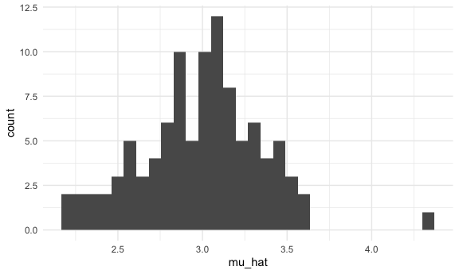
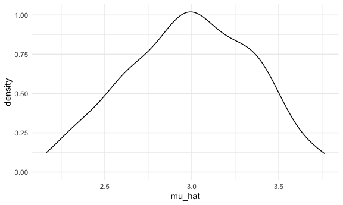
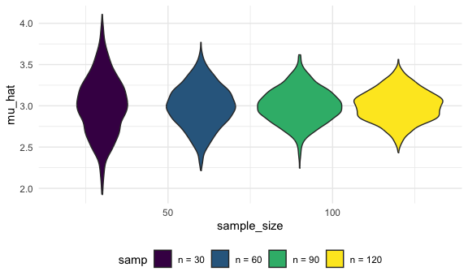
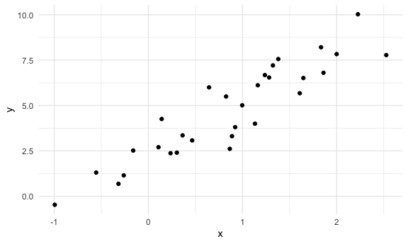
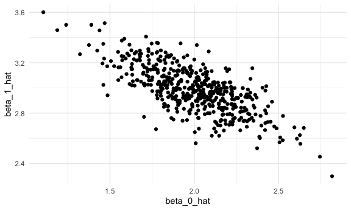

Simulations
================
Shivalika Chavan
2025-10-30

``` r
library(tidyverse)
## ── Attaching core tidyverse packages ──────────────────────── tidyverse 2.0.0 ──
## ✔ dplyr     1.1.4     ✔ readr     2.1.5
## ✔ forcats   1.0.0     ✔ stringr   1.5.1
## ✔ ggplot2   3.5.2     ✔ tibble    3.3.0
## ✔ lubridate 1.9.4     ✔ tidyr     1.3.1
## ✔ purrr     1.1.0     
## ── Conflicts ────────────────────────────────────────── tidyverse_conflicts() ──
## ✖ dplyr::filter() masks stats::filter()
## ✖ dplyr::lag()    masks stats::lag()
## ℹ Use the conflicted package (<http://conflicted.r-lib.org/>) to force all conflicts to become errors
source("source/sim_mean_sd.R")

knitr::opts_chunk$set(
  fig.width = 6,
  fig.asp = .6,
  out.width = "90%"
)

theme_set(theme_minimal() + theme(legend.position = "bottom"))

options(
  ggplot2.continuous.colour = "viridis",
  ggplot2.continuous.fill = "viridis"
)

scale_colour_discrete = scale_colour_viridis_d
scale_fill_discrete = scale_fill_viridis_d


set.seed(1)
```

``` r
sim_mean_sd(n_subj = 40)
```

    ## # A tibble: 1 × 2
    ##   mu_hat sigma_hat
    ##    <dbl>     <dbl>
    ## 1   3.18      1.77

Running a simulation. “Verifying” CLT using a for loop

``` r
output = vector("list", length = 100)

for (i in 1:100) {
  
  output[[i]] = sim_mean_sd(n_subj = 30)
  
}

sim_results = bind_rows(output)

sim_results |> 
  ggplot(aes(x = mu_hat)) +
  geom_histogram()
```

    ## `stat_bin()` using `bins = 30`. Pick better value with `binwidth`.



Using map statement

``` r
sim_results_df = 
  expand_grid(
    sample_size = 30,
    iter = 1:100
  ) |> 
  mutate(
    results = map(sample_size, sim_mean_sd)
  ) |> 
  unnest(results)

sim_results_df |> 
  ggplot(aes(x = mu_hat)) + 
  geom_density()
```



``` r
sim_results_df = 
  expand_grid(
    sample_size = c(30, 60, 90, 120),
    iter = 1:1000
  ) |> 
  mutate(
    results = map(sample_size, sim_mean_sd)
  ) |> 
  unnest(results)
```

Looking at the results

``` r
sim_results_df |> 
  mutate(
    samp = str_c("n = ", sample_size),
    samp = fct_inorder(samp)) |>
  ggplot(aes(x = sample_size, y = mu_hat, fill = samp)) + 
  geom_violin()
```



Summarizing

``` r
sim_results_df |> 
  group_by(sample_size) |> 
  summarize(
    empirical_mean = mean(mu_hat),
    empirical_se = sd(mu_hat)
  )
```

    ## # A tibble: 4 × 3
    ##   sample_size empirical_mean empirical_se
    ##         <dbl>          <dbl>        <dbl>
    ## 1          30           3.00        0.358
    ## 2          60           2.99        0.255
    ## 3          90           3.00        0.207
    ## 4         120           3.00        0.188

## Simple Linear Regression

``` r
sim_df = 
  tibble(
    x = rnorm(30, mean = 1, sd = 1),
    y = 2 + 3*x + rnorm(30, mean = 0, sd = 1)
  )

sim_df |> 
  ggplot(aes(x = x, y = y)) +
  geom_point()
```



``` r
slr_fit = lm(y ~ x, data = sim_df)

coef(slr_fit)
```

    ## (Intercept)           x 
    ##    2.332705    2.748355

Turn this into a function

``` r
sim_regression = function(n_subj, beta_0 = 2, beta_1 = 3){
  
  sim_df = 
  tibble(
    x = rnorm(n_subj, mean = 1, sd = 1),
    y = beta_0 + beta_1*x + rnorm(n_subj, mean = 0, sd = 1)
  )
  
  slr_fit = lm(y ~ x, data = sim_df)
  
  tibble(
    beta_0_hat = coef(slr_fit)[1],
    beta_1_hat = coef(slr_fit)[2]
  )
}
```

``` r
sim_regression(n_subj = 30)
```

    ## # A tibble: 1 × 2
    ##   beta_0_hat beta_1_hat
    ##        <dbl>      <dbl>
    ## 1       1.68       2.94

simulating with a for loop

``` r
output = vector("list", length = 500)
for (i in 1:500){
  output[[i]] = sim_regression(n_subj = 30)
}
output |> bind_rows()
```

    ## # A tibble: 500 × 2
    ##    beta_0_hat beta_1_hat
    ##         <dbl>      <dbl>
    ##  1       1.77       3.36
    ##  2       1.67       3.29
    ##  3       2.27       2.75
    ##  4       2.07       2.75
    ##  5       2.14       2.89
    ##  6       1.86       3.03
    ##  7       1.86       2.75
    ##  8       2.09       3.04
    ##  9       1.97       2.98
    ## 10       2.68       2.73
    ## # ℹ 490 more rows

``` r
slr_sim_results_df = 
  expand_grid(
    sample_size = 30,
    iter = 1:500
  ) |> 
  mutate(
    results = map(sample_size, sim_regression)
  ) |> 
  unnest(results)

slr_sim_results_df |> 
  ggplot(aes(x = beta_0_hat, y = beta_1_hat)) + 
  geom_point()
```



## Last example
